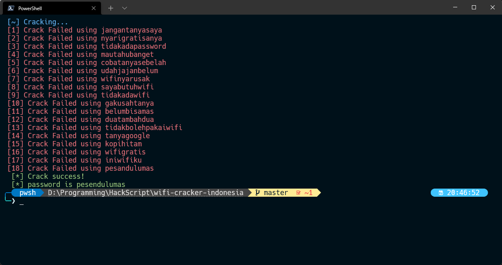
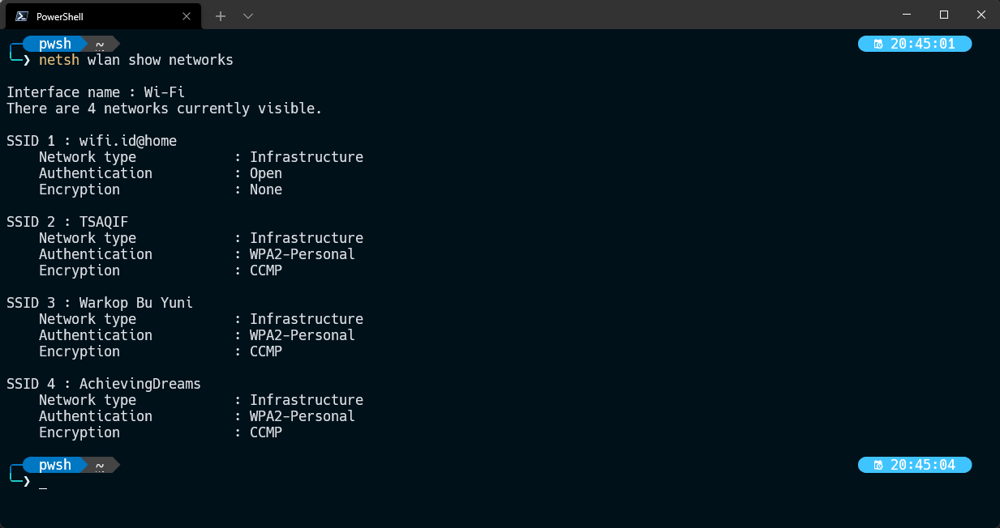
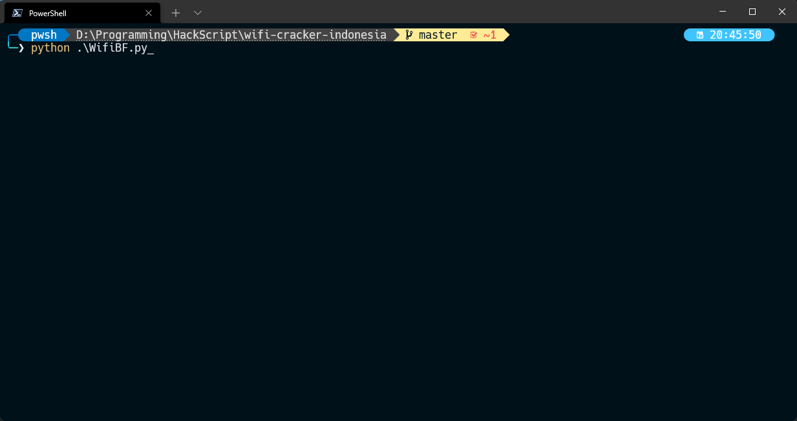
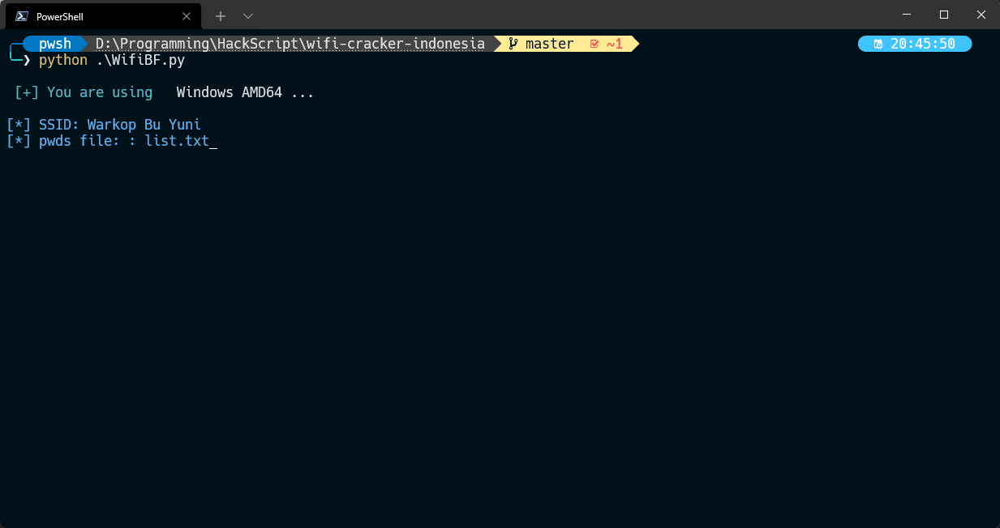

## This is not my original script all credits to [`BrahimJarrar`](https://github.com/BrahimJarrar/)
#### i modify it a bit in wordlist and code

:warning: Kami tidak bertanggung jawab atas semua tindakan illegal yang didampakkan oleh pengguna script ini

:white_check_mark: Work untuk windows dan linux

:heavy_exclamation_mark: wordlist akan terus diupdate seiring berjalannya waktu. So stay tuned terus ya!!! Monggo di fork/star repo ini

Halo, Ini adalah script bruteforcing yang dikhususkan untuk region Indonesia, yang mana sudah dilengkapi dengan common wordlist di wifi publik/private
yang ditemukan dengan metode OSINT dan Social Engineering.

### Pra Penggunaan
1. Install python versi 3 keatas
2. Install pip *untuk download package python
3. Install git
3. Ketikkan command dibawah di aplikasi CLI kalian (cmd/powershell/etc)
```bash
>: git clone https://github.com/mukhayyar/wifi-cracker-indonesia.git
```

```bash
>: cd wifi-cracker-indonesia
```

```bash
>: pip install -r requirements.txt
```

4. Aplikasi siap dijalankan :rocket:

### Penggunaan
1. Buka Aplikasi CLI yang ada di OS kamu(cmd/powershell/etc)
2. Lakukan scanning wifi yang terdeteksi di jaringan

Untuk Windows bisa pakai
```
netsh wlan show networks
```

Untuk Linux bisa pakai
```
ifconfig wlan0
```

3. Jika sudah muncul list network yang terdeteksi di perangkat. Copy text salah satu SSID wifi yang kalian incar
4. setelah itu masuk ke folder wifi-cracker-indonesia yang sudah diclone tadi
```bash
>: cd wifi-cracker-indonesia
```
5. Lalu ketikkan
```bash
>: python .\WifiBF.py 
```

Tunggu sebentar lalu kamu akan diarahkan ke mode input data
```bash
[*] SSID: *paste SSID yang sudah dicopy disini*
```
Tekan enter setelah memasukkan SSID, setelah itu ketikkan list.txt seperti dibawah ini lalu tekan enter
```bash
[*] pwds file: list.txt
```
```
Note: Pada pwds file, jika kalian punya list password sendiri silahkan diganti sesuai dengan nama file yang kalian buat!
```

6. Jika sudah, aplikasi akan melakukan cracking pada wifi yang kalian incar. Hasilnya seperti dibawah

-------------------------------------



-------------------------------------

##### :warning: Ingat! metode ini tidak menjamin bisa melakukan cracking pada setiap wifi yang ada di publik/privat. Metode ini bergantung pada amunisi wordlist yang kalian punya dan kecocokan dengan yang dipakai didunia nyata oleh orang-orang

### _🕷️ Available command line options_
[`CopyRight`](https://github.com/BrahimJarrar/)

    usage: [options]
      -h , --help           show this help message and exit
      -s , --ssid           SSID WIFI Target
      -w , --wordlist       list of passwords
      -t , --threads        number of threads #Comming soon
      -v , --version        version

-------------------------------------

## Documentation

<h1 align="center">
  <br>
  <a href="https://github.com/mukhayyar/"></a>
  <a href="https://github.com/mukhayyar/"></a>
  <a href="https://github.com/mukhayyar/"></a>
  <a href="https://github.com/mukhayyar/"></a>
  <a href="https://github.com/mukhayyar/"></a>
  </br>
</h1>
